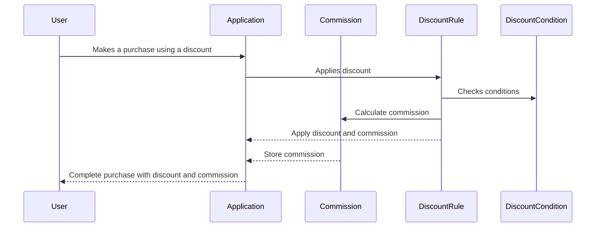

# Extending Medusa JS for Affiliate Program with Commission

## Introduction

In this documentation, we will discuss how to extend the Medusa JS open-source application to support an affiliate program with commission functionality. The goal is to enable discounts to be linked to users, where these users can earn commissions when a sale is made using the applied discount. This feature enhancement requires adapting the existing structure, primarily focusing on entities such as DiscountRule and DiscountCondition.

## Feature Overview

The extended functionality aims to allow users to earn commissions through discounts, with the following key features:

- Discounts can be linked to specific users.
- Commissions can be set up using parameters similar to discounts, either as a fixed amount or a percentage of the sale.

## Adaptation Steps

To achieve this, follow these adaptation steps:

1. **Introduce the Commission Entity:** Create a new entity called "Commission" to track and store commissions earned by users. The Commission entity should include:
   - `user_id`: Identifying the user earning the commission.
   - `amount`: Storing the commission amount.

2. **Modify the DiscountRule Entity:** Enhance the DiscountRule entity to support user-specific discounts and commission parameters. Add the following attributes:
   - `user_id`: Links the discount to a specific user eligible for commission.
   - `commission_percentage`: Specifies the percentage of the sale amount that the user will earn as commission.

3. **Modify the DiscountCondition Entity:** Update the DiscountCondition entity to indicate conditions associated with earning commissions. Introduce an attribute:
   - `earn_commission`: A boolean attribute that defines whether a condition is linked to commission earnings.

4. **Revise the Discount Application Process:** Adapt the discount application process to account for commission calculations:
   - Calculate the commission amount based on the `commission_percentage` specified in the DiscountRule.
   - Create a Commission record with the `user_id` and the commission amount.

## Medus Documentation

https://docs.medusajs.com/modules/discounts

https://docs.medusajs.com/modules/users
